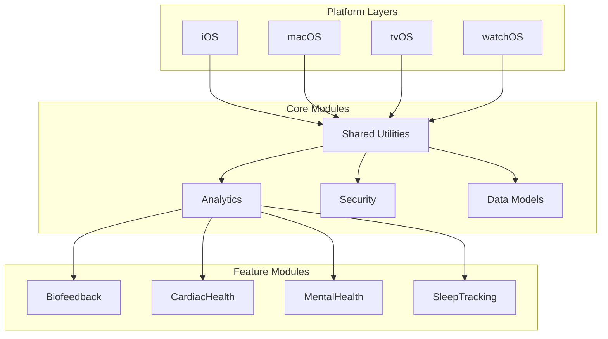

# HealthAI 2030 Architecture Documentation

## 1. System Overview
HealthAI 2030 follows a modular, platform-agnostic architecture with clear separation between:
- Platform-specific implementations (iOS/macOS/tvOS/watchOS)
- Core shared modules
- Feature modules

## 2. Architectural Diagram


## 3. Module Responsibilities

### Core Modules
- **Shared Utilities**: Cross-platform utilities (PerformanceOptimizer, logging, etc.)
- **Analytics**: Data processing and ML capabilities
- **Security**: Encryption, authentication, privacy
- **Data Models**: Core business objects and persistence

### Feature Modules
Each feature module contains:
- Views
- ViewModels
- Managers
- Models
- Tests

## 4. PerformanceOptimizer Location
The PerformanceOptimizer component belongs in:
`Modules/Shared/Utilities/Sources/PerformanceOptimizer/`

## 5. Dependency Rules
1. Platform layers can depend on Core modules
2. Core modules must remain platform-agnostic
3. Feature modules can depend on Core modules
4. No circular dependencies allowed

## 6. File Structure Changes
```
HealthAI 2030/
├── Modules/
│   ├── Shared/
│   │   ├── Utilities/
│   │   │   ├── Sources/
│   │   │   │   └── PerformanceOptimizer/
│   │   │   │       ├── PerformanceOptimizer.swift
│   │   │   │       └── PerformanceOptimizer+Platform.swift
│   │   │   └── Tests/
│   │   │       └── PerformanceOptimizerTests.swift
```

## 7. Package Structure

The project uses Swift Package Manager with module-based packages located in:
- `Modules/Shared/` for core utilities
- `Modules/Features/` for feature implementations

Each module contains:
- Package.swift with target definitions
- Sources/ for implementation
- Tests/ for unit tests

Example structure:
```
Modules/
├── Shared/
│   └── Utilities/
│       ├── Package.swift
│       ├── Sources/
│       └── Tests/
└── Features/
    └── SleepTracking/
        ├── Package.swift
        ├── Sources/
        └── Tests/
```

## 8. Future Considerations
- CI/CD pipeline adjustments
- Documentation standards