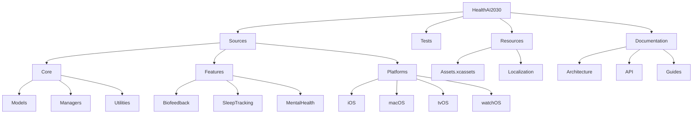

# HealthAI2030 Directory Reorganization Plan



## Current Issues

### 1. Naming Inconsistencies
- Mixed use of spaces ("HealthAI 2030" vs "HealthAI2030")
- Inconsistent pluralization (Views vs View)
- Case inconsistencies

### 2. Structure Problems
- Platform-specific code not clearly separated
- Documentation scattered across multiple locations
- Test files not consistently located

### 3. Apple Standards Violations
- Spaces in directory names
- Non-standard asset locations
- Inconsistent localization structure

## Proposed Changes

### 1. Naming Conventions
- Remove all spaces from directory names (`HealthAI2030`)
- Use PascalCase for all Swift code directories
- Use lowercase for resource directories
- Pluralize collections (Views, Models, Managers)
- Singularize individual items (View, Model)

### 2. Directory Hierarchy
```
HealthAI2030/
├── Sources/
│   ├── Core/
│   ├── Features/
│   └── Platforms/
├── Tests/
├── Resources/
│   ├── Assets.xcassets/
│   └── Localization/
└── Documentation/
```

### 3. Platform-Specific Code
- Move to dedicated `Platforms/` directory with subdirectories:
  - iOS/
  - macOS/
  - tvOS/
  - watchOS/

### 4. Documentation
- Centralize in `Documentation/` with subfolders:
  - Architecture/
  - API/
  - Guides/
  - Migration/

### 5. Asset Management
- Keep `Assets.xcassets` in Resources/
- Standardize asset naming:
  - `Icon<Feature>`
  - `Image<Purpose>`

### 6. Localization
- Move to `Resources/Localization/`
- Standard structure:
  - en.lproj/
  - de.lproj/
  - etc.

## Migration Path

1. **Phase 1**: Rename root directory to `HealthAI2030`
2. **Phase 2**: Reorganize platform-specific code
3. **Phase 3**: Consolidate documentation
4. **Phase 4**: Standardize test locations
5. **Phase 5**: Update build settings and paths

## Implementation Checklist

- [x] Rename root directory (completed)
- [x] Create new directory structure (completed)
- [x] Move iOS platform code (completed)
- [x] macOS platform files located in `HealthAI 2030 macOS/`
- [x] macOS files moved to `HealthAI2030/Sources/Platforms/macOS/`
- [x] Cleaned up duplicate directories
- [x] Verify original macOS directory is empty
- [x] tvOS platform files located in `HealthAI 2030 tvOS/`
- [x] tvOS files moved to `HealthAI2030/Sources/Platforms/tvOS/`
- [x] Verify original tvOS directory is empty
- [x] watchOS platform files located in `HealthAI 2030 WatchKit App/` and `HealthAI 2030 WatchKit Extension/`
- [x] Migrate Package.swift files to new module structure (completed)
- [ ] Consolidate documentation
- [ ] Reorganize assets
- [ ] Update localization paths
- [ ] Update build settings
- [ ] Update CI/CD pipelines
- [ ] Update documentation references

## Current Status
- iOS platform reorganization completed successfully
- Platform files located for all platforms:
  - macOS: `HealthAI 2030 macOS/`
  - tvOS: `HealthAI 2030 tvOS/`
  - watchOS: `HealthAI 2030 WatchKit App/` and `HealthAI 2030 WatchKit Extension/`
- Ready to proceed with reorganization
- Build settings and documentation updates pending file relocation

## Verification Steps
1. macOS:
   - Verify all macOS-specific files are in `HealthAI 2030 macOS/`
   - Check for macOS availability annotations (`@available(macOS)`)
   - Test build on macOS target

2. tvOS:
    - Verify all tvOS-specific files are in `HealthAI2030/Sources/Platforms/tvOS/`
    - Check for tvOS availability annotations (`@available(tvOS)`)
    - Test build on tvOS target
    - Original source directory verified empty

3. watchOS:
   - Verify all watchOS-specific files are in WatchKit directories
   - Check for watchOS availability annotations (`@available(watchOS)`)
   - Test build on watchOS target

## Platform-Specific Considerations
- macOS:
  - Requires special entitlements for HealthKit access
  - Needs Mac Catalyst compatibility checks
  - Different UI patterns than iOS

- tvOS:
  - Requires focus engine integration
  - Needs Siri Remote gesture handling
  - Different navigation patterns

- watchOS:
  - Requires complication support
  - Needs background refresh configuration
  - Different memory constraints[x] watchOS files migrated to HealthAI2030/Sources/Platforms/watchOS
Migration completed: Fri Jul  4 14:53:26 CDT 2025
[x] macOS files migrated to HealthAI2030/Sources/Platforms/macOS
[x] tvOS files migrated to HealthAI2030/Sources/Platforms/tvOS
All platform migrations completed: Fri Jul  4 14:54:34 CDT 2025
