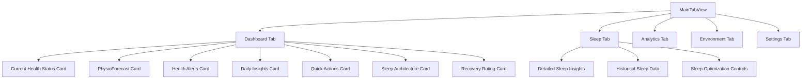

# HealthAI 2030 M1 – Alpha Milestone Plan

## 1. Closed-loop Sleep Nudges: Adaptive Stimuli & Environment Orchestrator

### 1.1. Adaptive Stimuli Layer Design

The core of the adaptive stimuli will be a new Reinforcement Learning (RL) Agent.

*   **RL Agent Implementation:**
    *   **Location:** A new Swift file, `HealthAI 2030/ML/RLAgent.swift`, will be created.
    *   **Functionality:** This class will be responsible for determining the optimal sleep nudges based on the current sleep state and environmental data. For M1, a rule-based system will serve as a placeholder for the full RL model, simulating its decision-making process.
    *   **Inputs:** It will receive `SleepState` (from `SleepOptimizationManager`) and `EnvironmentData` (from `EnvironmentManager`).
    *   **Outputs:** It will output a `NudgeAction` which could be an audio nudge, haptic nudge, environment adjustment, or bed motor adjustment.
    *   **Interaction:** The `SleepOptimizationManager` will be refactored to consult the `RLAgent` for intervention decisions, replacing its current rule-based triggers.

*   **Integration with Adaptive Stimuli:**
    *   **Audio Nudges (Pink Noise, Isochronic Tones, Binaural Beats, Nature Sounds):** The `RLAgent` will interact with the existing `AdaptiveAudioManager` and `AudioGenerationEngine` to trigger and control these audio stimuli.
    *   **Haptic Pulses:** The `RLAgent` will trigger haptic feedback via `SleepOptimizationManager`'s existing `triggerHapticPulse` method.
    *   **Bed-position Motors:**
        *   **Integration Type:** This will require a custom integration (e.g., Bluetooth or Wi-Fi), as it's not a HomeKit device.
        *   **New Component:** A new manager class, `HealthAI 2030/Managers/BedMotorManager.swift`, will be created. This class will encapsulate the communication and control logic for bed motors (simulated for M1).
        *   **Actions:** The `BedMotorManager` will expose methods such as `adjustHeadElevation(to: Double)`, `adjustFootElevation(to: Double)`, `startMassage(intensity: Double)`, and `stopMassage()`. The `RLAgent` will call these methods.

### 1.2. Environment Orchestrator Layer Design

The `EnvironmentManager` will be the central orchestrator for HomeKit devices.

*   **Consolidation and Refactoring:**
    *   The `EnvironmentController` class currently embedded within `SleepOptimizationManager.swift` will be removed.
    *   `SleepOptimizationManager` will be updated to directly use `EnvironmentManager.shared` for all environmental adjustments, ensuring a single source of truth for HomeKit interactions.
    *   Calls like `environmentController?.optimizeForDeepSleep()` will be replaced with direct calls to `EnvironmentManager.shared` methods (e.g., `EnvironmentManager.shared.optimizeForSleep()`).

*   **HomeKit Device Management Enhancements:**
    *   **Blinds:** `EnvironmentManager.swift` will be extended with a method like `adjustBlinds(position: Double)` to control smart blinds via HomeKit.
    *   **HEPA Filters:** `EnvironmentManager.swift` will include a method like `setHEPAFilterState(on: Bool, mode: HEPAFilterMode)` to manage HEPA air purifiers via HomeKit.
    *   Existing methods for HVAC (`adjustTemperature`), humidifier (`adjustHumidity`), and lighting (`adjustLighting`) will be reviewed and ensured they are robust for programmatic control by the `RLAgent`.

### 1.3. Architectural Flow for Closed-loop Sleep Nudges

```mermaid
graph TD
    A[Apple Watch Sensors] --> B(HealthDataManager);
    B --> C[Sleep Stage Prediction Model];
    C --> D{SleepOptimizationManager};
    D --> E[Sleep Metrics];
    E --> F[RLAgent];
    F --> G[AdaptiveAudioManager];
    F --> H[EnvironmentManager];
    F --> I[BedMotorManager];
    G --> J[AudioGenerationEngine];
    J --> K[Audio Output];
    H --> L[HomeKit Devices<br>(HVAC, Humidifier, Blinds, HEPA, Lights)];
    I --> M[Bed Motors];
    D -- Current Sleep Stage --> F;
    H -- Environmental Data --> F;
    F -- Nudge Actions --> G;
    F -- Nudge Actions --> H;
    F -- Nudge Actions --> I;
```

### 2. Basic Dashboard UI/UX Design

The basic dashboard will provide a high-level overview of sleep architecture, recovery rating, and the PhysioForecast™ vector.

#### 2.1. Key Information Display

*   **Sleep Architecture:**
    *   **Data Source:** This information will be sourced from the `SleepOptimizationManager.shared.sleepMetrics` and `SleepOptimizationManager.shared.currentSleepStage` properties.
    *   **Display Elements:** A new SwiftUI view, `SleepArchitectureCard.swift`, will be created to display:
        *   The current sleep stage (e.g., "Deep Sleep", "REM Sleep").
        *   A numerical sleep quality score (e.g., 85%).
        *   A visual breakdown of time spent in each sleep stage (Deep, Light, REM, Awake) using a segmented bar chart or a simple percentage display.
        *   Total sleep time for the last completed sleep session.

*   **Recovery Rating:**
    *   **Data Source:** This will be derived from `SleepOptimizationManager.shared.sleepQuality` and potentially other relevant health metrics from `HealthDataManager` or `PredictiveAnalyticsManager`.
    *   **Display Elements:** A new SwiftUI view, `RecoveryRatingCard.swift`, will be created. It will present:
        *   A qualitative rating (e.g., "Excellent", "Good", "Fair", "Poor").
        *   A visual indicator such as a circular progress bar, a color-coded icon, or a simple text label with a background color reflecting the rating.

*   **PhysioForecast™ Vector:**
    *   This component is already present in `MainTabView.swift` within the `PhysioForecastCard`. The existing display of Energy, Mood Stability, Cognitive Acuity, and Musculoskeletal Resilience will be retained as it aligns with the "vector" concept.

#### 2.2. User Interaction

*   **Dashboard View (`DashboardView`):**
    *   The existing `DashboardView` in `MainTabView.swift` will be enhanced to integrate the new `SleepArchitectureCard` and `RecoveryRatingCard` prominently. These will likely be placed alongside or near the "Current Health Status" and "Tomorrow's Forecast" cards.
    *   The "Quick Actions" card will be updated to ensure the "Start Sleep" action correctly initiates the sleep optimization process via `SleepOptimizationManager`.

*   **Sleep View (`SleepView`):**
    *   The current placeholder `SleepView` will be developed to provide more detailed insights into sleep patterns, historical sleep data, and granular controls for sleep optimization settings and interventions. This view will serve as the primary hub for users to manage their sleep.

*   **Cross-Platform UI (SwiftUI Shared Views):**
    *   All new UI components (`SleepArchitectureCard`, `RecoveryRatingCard`) will be designed as reusable SwiftUI views, adhering to the existing pattern of shared views (e.g., `HealthMetricView`, `ForecastMetricRow`).
    *   `@EnvironmentObject` will be consistently used to pass shared data managers (`SleepOptimizationManager`, `HealthDataManager`, `PredictiveAnalyticsManager`) to these views, ensuring efficient data flow and reactivity.

#### 2.3. High-Level UI/UX Flow



### Next Steps for Implementation (after plan approval):

1.  Implement the `RLAgent` class with a basic rule-based system for M1.
2.  Create the `BedMotorManager` class with simulated control.
3.  Refactor `SleepOptimizationManager` to use `EnvironmentManager.shared` and integrate with `RLAgent`.
4.  Enhance `EnvironmentManager` to include blinds and HEPA filter control (placeholders).
5.  Develop `SleepArchitectureCard` and `RecoveryRatingCard` SwiftUI views.
6.  Integrate new cards into `DashboardView`.
7.  Update `SleepView` to display more detailed sleep information.