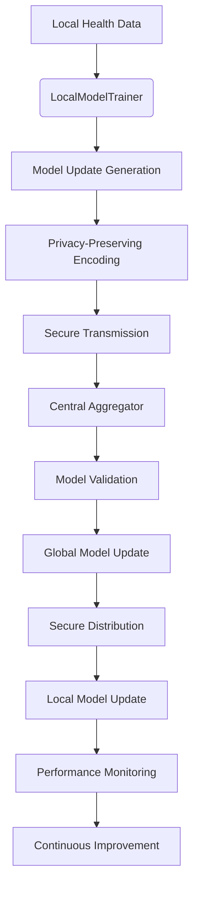
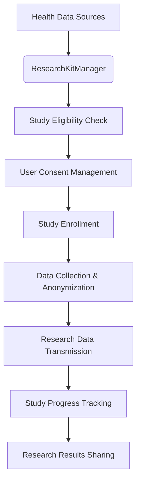
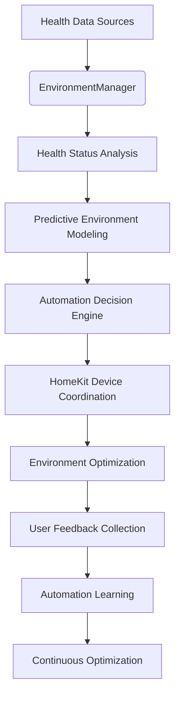
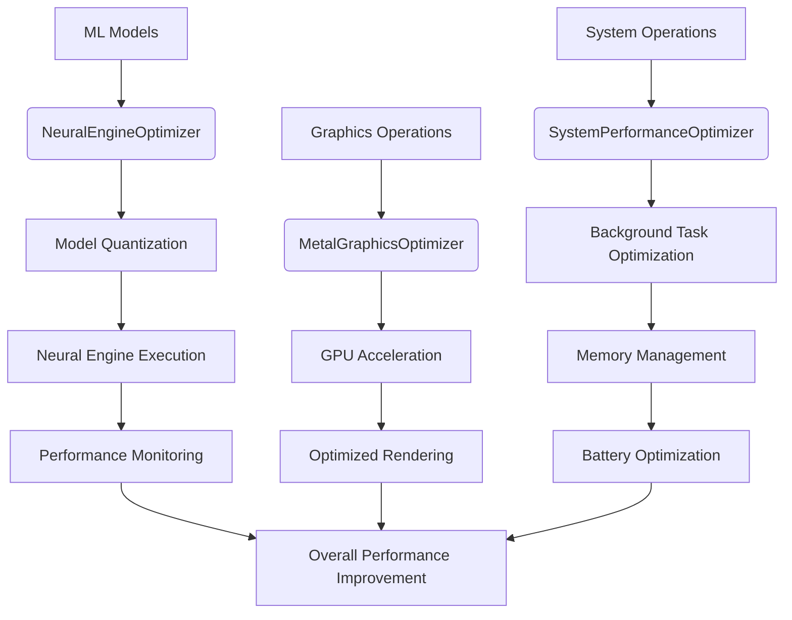
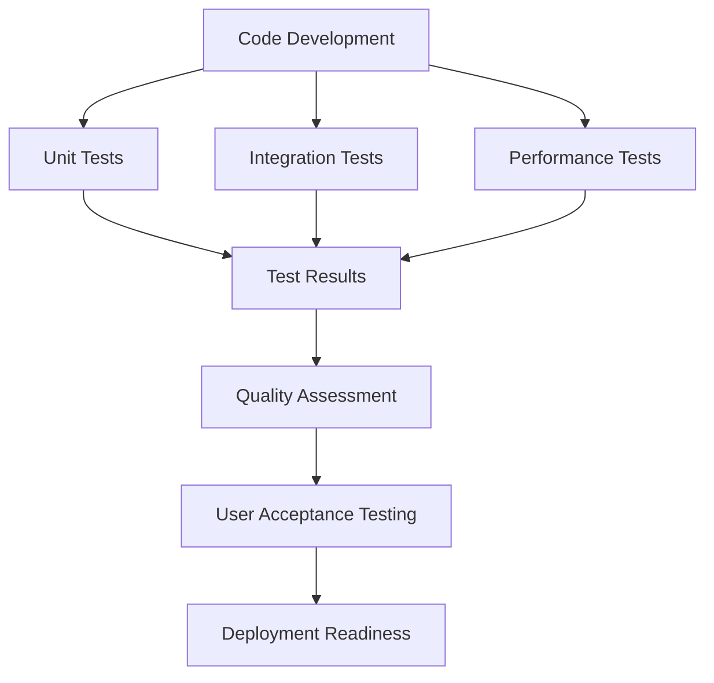

# HealthAI 2030 M3 – Gamma Milestone Plan

This plan outlines the advanced features and optimizations for the HealthAI 2030 M3 – Gamma milestone, building upon the completed M2 Beta foundation.

## 1. Advanced Analytics Dashboard

The "Advanced Analytics Dashboard" will provide comprehensive health insights, trend analysis, and predictive modeling visualization across all health data streams.

### 1.1. Core Analytics Components

*   **Comprehensive Health Insights Engine:**
    *   **Multi-Dimensional Analysis:** Correlate data across ECG, sleep, activity, environment, and biofeedback sessions.
    *   **Trend Detection:** Identify patterns and anomalies in health metrics over time.
    *   **Predictive Modeling:** Forecast health outcomes based on current trends and historical data.
    *   **Risk Assessment:** Calculate personalized health risk scores across multiple dimensions.

*   **Advanced Analytics Manager:**
    *   New `AdvancedAnalyticsManager.swift`: Central orchestrator for all analytics operations.
    *   **Data Aggregation:** Collect and normalize data from all health sources.
    *   **Statistical Analysis:** Perform advanced statistical computations (correlation, regression, time-series analysis).
    *   **Machine Learning Integration:** Leverage existing ML models for predictive insights.
    *   **Real-time Processing:** Provide live analytics updates as new data arrives.

*   **Analytics Modules:**

    *   **Sleep Architecture Analytics:**
        *   **Functionality:** Deep analysis of sleep patterns, quality trends, and optimization opportunities.
        *   **Components:**
            *   `SleepAnalyticsEngine.swift`: Advanced sleep pattern analysis and trend detection.
            *   `SleepQualityPredictor.swift`: Predict sleep quality based on daily activities and environment.
            *   `SleepOptimizationRecommender.swift`: Generate personalized sleep improvement recommendations.
        *   **Integration:** Connects with `SleepOptimizationManager` and `EnvironmentManager`.

    *   **Cardiac Health Analytics:**
        *   **Functionality:** Comprehensive cardiac health assessment and trend analysis.
        *   **Components:**
            *   `CardiacHealthAnalyzer.swift`: Aggregate and analyze all cardiac metrics.
            *   `CardiacRiskCalculator.swift`: Calculate personalized cardiac risk scores.
            *   `CardiacTrendPredictor.swift`: Predict cardiac health trends and potential issues.
        *   **Integration:** Leverages all ECG insight modules from M2 Beta.

    *   **Lifestyle Impact Analytics:**
        *   **Functionality:** Analyze how lifestyle choices affect overall health outcomes.
        *   **Components:**
            *   `LifestyleImpactAnalyzer.swift`: Correlate activities, diet, and environment with health metrics.
            *   `BehavioralPatternDetector.swift`: Identify behavioral patterns that impact health.
            *   `LifestyleOptimizer.swift`: Generate personalized lifestyle recommendations.
        *   **Integration:** Connects with `HealthDataManager` and `EnvironmentManager`.

### 1.2. Advanced Analytics Dashboard UI/UX

*   **Dashboard Components:**

    *   **Health Overview Card:**
        *   **Multi-Metric Display:** Show key health indicators in a unified view.
        *   **Trend Indicators:** Visual trend arrows and percentage changes.
        *   **Risk Level Indicators:** Color-coded risk levels for different health dimensions.
        *   **Quick Actions:** One-tap access to detailed analytics.

    *   **Trend Analysis Charts:**
        *   **Interactive Time Series:** Multi-dimensional charts showing health trends over time.
        *   **Correlation Visualizations:** Heat maps and scatter plots showing relationships between metrics.
        *   **Predictive Trend Lines:** Show forecasted health trajectories.
        *   **Zoom and Filter:** Interactive controls for detailed analysis.

    *   **Insights Panel:**
        *   **AI-Generated Insights:** Natural language explanations of health patterns.
        *   **Recommendation Engine:** Personalized health improvement suggestions.
        *   **Action Items:** Prioritized list of health actions to take.
        *   **Progress Tracking:** Visual progress indicators for health goals.

    *   **Comparative Analytics:**
        *   **Peer Comparison:** Anonymous comparison with similar demographics.
        *   **Historical Comparison:** Compare current metrics with past periods.
        *   **Goal Tracking:** Progress toward personalized health goals.

### 1.3. Data Flow for Advanced Analytics

```mermaid
graph TD
    A[Health Data Sources<br>(ECG, Sleep, Activity, Environment)] --> B(AdvancedAnalyticsManager);
    B --> C[Data Aggregation & Normalization];
    C --> D[Statistical Analysis Engine];
    D --> E[Trend Detection];
    D --> F[Correlation Analysis];
    D --> G[Anomaly Detection];

    E & F & G --> H[Predictive Modeling];
    H --> I[Risk Assessment];
    H --> J[Insight Generation];

    I & J --> K[Analytics Dashboard UI];
    K --> L[User Insights & Actions];
```

## 2. Federated Learning Integration

The "Federated Learning Integration" will enable privacy-preserving model updates across the HealthAI 2030 ecosystem while maintaining user data privacy.

### 2.1. Federated Learning Architecture

*   **Privacy-Preserving Model Updates:**
    *   **Local Model Training:** Train ML models on-device using local health data.
    *   **Model Aggregation:** Securely aggregate model updates without sharing raw data.
    *   **Differential Privacy:** Add noise to model updates to protect individual privacy.
    *   **Secure Communication:** Encrypted transmission of model updates to central server.

*   **Federated Learning Manager:**
    *   New `FederatedLearningManager.swift`: Orchestrates federated learning operations.
    *   **Model Versioning:** Track and manage different model versions.
    *   **Update Scheduling:** Coordinate model update cycles across devices.
    *   **Quality Assurance:** Validate model updates before deployment.
    *   **Rollback Capability:** Revert to previous model versions if needed.

*   **Federated Learning Components:**

    *   **Local Model Trainer:**
        *   **Functionality:** Train ML models on local device data.
        *   **Components:**
            *   `LocalModelTrainer.swift`: On-device model training engine.
            *   `ModelUpdateGenerator.swift`: Generate model updates for aggregation.
            *   `PrivacyPreservingEncoder.swift`: Encode model updates with differential privacy.
        *   **Integration:** Works with all existing ML models from M2 Beta.

    *   **Secure Aggregation:**
        *   **Functionality:** Securely aggregate model updates from multiple devices.
        *   **Components:**
            *   `SecureAggregator.swift`: Privacy-preserving model aggregation.
            *   `ModelValidator.swift`: Validate aggregated model quality.
            *   `UpdateDistributor.swift`: Distribute updated models to devices.
        *   **Security:** Implements homomorphic encryption and secure multi-party computation.

    *   **Model Deployment:**
        *   **Functionality:** Deploy updated models across the ecosystem.
        *   **Components:**
            *   `ModelDeploymentManager.swift`: Coordinate model deployment.
            *   `ModelPerformanceMonitor.swift`: Monitor model performance post-deployment.
            *   `A/B Testing Engine.swift`: Test new models against existing ones.
        *   **Integration:** Seamless integration with existing ML model managers.

### 2.2. Federated Learning Data Flow



## 3. Emergency Response System

The "Emergency Response System" will provide enhanced emergency alert handling, automated response coordination, and integration with emergency services.

### 3.1. Emergency Response Components

*   **Enhanced Emergency Alert Manager:**
    *   Enhanced `EmergencyAlertManager.swift`: Advanced emergency response coordination.
    *   **Multi-Level Alerts:** Different alert levels based on severity and urgency.
    *   **Automated Response:** Automatic actions based on alert type and severity.
    *   **Emergency Contact Integration:** Automatic notification of emergency contacts.
    *   **Location Services:** GPS tracking and location sharing with emergency services.

*   **Emergency Response Modules:**

    *   **Cardiac Emergency Handler:**
        *   **Functionality:** Specialized handling for cardiac emergencies.
        *   **Components:**
            *   `CardiacEmergencyHandler.swift`: Cardiac-specific emergency protocols.
            *   `ECGDataCollector.swift`: Collect and transmit ECG data to emergency services.
            *   `CardiacRiskAssessor.swift`: Assess cardiac risk in real-time.
        *   **Integration:** Connects with ECG insight modules and emergency services.

    *   **Fall Detection & Response:**
        *   **Functionality:** Detect falls and coordinate appropriate response.
        *   **Components:**
            *   `FallDetector.swift`: Advanced fall detection using accelerometer and gyroscope.
            *   `FallResponseCoordinator.swift`: Coordinate response to detected falls.
            *   `MobilityAssessment.swift`: Assess mobility and fall risk.
        *   **Integration:** Works with Apple Watch sensors and emergency contacts.

    *   **Medical History Transmitter:**
        *   **Functionality:** Securely transmit relevant medical history to emergency services.
        *   **Components:**
            *   `MedicalHistoryManager.swift`: Manage and organize medical history data.
            *   `EmergencyDataFormatter.swift`: Format medical data for emergency services.
            *   `SecureDataTransmitter.swift`: Securely transmit data to emergency services.
        *   **Privacy:** Implements strict privacy controls and user consent mechanisms.

### 3.2. Emergency Response Data Flow

```mermaid
graph TD
    A[Health Sensors<br>(ECG, Accelerometer, etc.)] --> B(EmergencyAlertManager);
    B --> C[Alert Severity Assessment];
    C --> D{Alert Level};
    D --> E[Cardiac Emergency Handler];
    D --> F[Fall Detection & Response];
    D --> G[General Emergency Response];

    E --> H[ECG Data Collection];
    F --> I[Fall Assessment];
    G --> J[General Assessment];

    H & I & J --> K[Emergency Contact Notification];
    H & I & J --> L[Emergency Services Alert];
    H & I & J --> M[Medical History Transmission];

    K & L & M --> N[Response Coordination];
    N --> O[Follow-up Actions];
```

## 4. ResearchKit Integration

The "ResearchKit Integration" will enable users to participate in clinical studies and contribute to medical research while maintaining privacy.

### 4.1. ResearchKit Components

*   **ResearchKit Manager:**
    *   New `ResearchKitManager.swift`: Orchestrates ResearchKit integration.
    *   **Study Management:** Manage participation in multiple research studies.
    *   **Data Contribution:** Securely contribute anonymized health data to studies.
    *   **Consent Management:** Manage user consent for different studies.
    *   **Study Notifications:** Notify users about new studies and updates.

*   **ResearchKit Modules:**

    *   **Study Participation Engine:**
        *   **Functionality:** Enable participation in clinical research studies.
        *   **Components:**
            *   `StudyParticipationManager.swift`: Manage study enrollment and participation.
            *   `StudyDataCollector.swift`: Collect and format data for research studies.
            *   `StudyProgressTracker.swift`: Track progress in research studies.
        *   **Integration:** Connects with all health data sources and ResearchKit framework.

    *   **Anonymized Data Sharing:**
        *   **Functionality:** Share anonymized health data for research purposes.
        *   **Components:**
            *   `DataAnonymizer.swift`: Anonymize health data for research sharing.
            *   `ResearchDataFormatter.swift`: Format data according to study requirements.
            *   `SecureResearchTransmitter.swift`: Securely transmit research data.
        *   **Privacy:** Implements strict anonymization and privacy controls.

    *   **Clinical Trial Integration:**
        *   **Functionality:** Participate in clinical trials and medical research.
        *   **Components:**
            *   `ClinicalTrialManager.swift`: Manage clinical trial participation.
            *   `TrialDataCollector.swift`: Collect trial-specific data.
            *   `TrialComplianceMonitor.swift`: Monitor compliance with trial protocols.
        *   **Integration:** Works with ResearchKit and existing health monitoring.

### 4.2. ResearchKit Data Flow



## 5. HomeKit Advanced Automation

The "HomeKit Advanced Automation" will provide intelligent environment control based on health data and predictive analytics.

### 5.1. Advanced HomeKit Components

*   **Intelligent Environment Controller:**
    *   Enhanced `EnvironmentManager.swift`: Advanced environment automation.
    *   **Predictive Control:** Anticipate user needs based on health data and patterns.
    *   **Multi-Device Coordination:** Coordinate multiple HomeKit devices for optimal environment.
    *   **Health-Based Automation:** Adjust environment based on health status and needs.
    *   **Learning Capabilities:** Learn user preferences and optimize automation over time.

*   **Advanced Automation Modules:**

    *   **Sleep Environment Optimizer:**
        *   **Functionality:** Optimize sleep environment based on sleep data and preferences.
        *   **Components:**
            *   `SleepEnvironmentOptimizer.swift`: Advanced sleep environment control.
            *   `SleepPredictor.swift`: Predict optimal sleep conditions.
            *   `SleepAutomationScheduler.swift`: Schedule sleep environment changes.
        *   **Integration:** Works with `SleepOptimizationManager` and HomeKit devices.

    *   **Health-Responsive Lighting:**
        *   **Functionality:** Adjust lighting based on health status and circadian rhythms.
        *   **Components:**
            *   `CircadianLightingController.swift`: Circadian rhythm-based lighting control.
            *   `HealthResponsiveLighting.swift`: Lighting adjustments based on health status.
            *   `LightingOptimizer.swift`: Optimize lighting for health and well-being.
        *   **Integration:** Connects with HomeKit lighting systems and health data.

    *   **Climate Control Intelligence:**
        *   **Functionality:** Intelligent climate control based on health and activity data.
        *   **Components:**
            *   `HealthAwareClimateController.swift`: Health-based climate control.
            *   `ActivityBasedClimateControl.swift`: Climate control based on activity levels.
            *   `ClimateOptimizer.swift`: Optimize climate for health and comfort.
        *   **Integration:** Works with HomeKit HVAC and climate control systems.

### 5.2. HomeKit Automation Data Flow



## 6. Performance Optimization

The "Performance Optimization" will focus on Neural Engine acceleration, Metal optimization, and overall system performance improvements.

### 6.1. Performance Optimization Components

*   **Neural Engine Optimizer:**
    *   New `NeuralEngineOptimizer.swift`: Optimize ML model execution on Neural Engine.
    *   **Model Quantization:** Optimize model size and performance through quantization.
    *   **Neural Engine Acceleration:** Leverage Neural Engine for ML model inference.
    *   **Performance Monitoring:** Monitor and optimize Neural Engine performance.
    *   **Battery Optimization:** Minimize battery consumption during ML operations.

*   **Metal Graphics Optimization:**
    *   New `MetalGraphicsOptimizer.swift`: Optimize graphics rendering using Metal.
    *   **Vision Pro Rendering:** Optimize Vision Pro graphics rendering performance.
    *   **Real-time Visualization:** Optimize real-time health data visualization.
    *   **GPU Acceleration:** Leverage GPU for complex graphics operations.
    *   **Memory Management:** Optimize memory usage for graphics operations.

*   **System Performance Optimizer:**
    *   New `SystemPerformanceOptimizer.swift`: Overall system performance optimization.
    *   **Background Task Management:** Optimize background task scheduling and execution.
    *   **Memory Optimization:** Optimize memory usage across the application.
    *   **Battery Life Optimization:** Minimize battery consumption while maintaining functionality.
    *   **Network Optimization:** Optimize network usage and data transmission.

### 6.2. Performance Optimization Data Flow



## 7. Comprehensive Testing Framework

The "Comprehensive Testing Framework" will ensure quality, reliability, and performance across all components.

### 7.1. Testing Components

*   **Unit Testing Suite:**
    *   **ML Model Testing:** Test all ML models with various input scenarios.
    *   **Manager Testing:** Test all manager classes and their interactions.
    *   **Utility Testing:** Test utility functions and helper classes.
    *   **Data Model Testing:** Test data models and their validation.

*   **Integration Testing Suite:**
    *   **Cross-Component Testing:** Test interactions between different components.
    *   **Data Flow Testing:** Test data flow between different modules.
    *   **API Testing:** Test external API integrations and data exchange.
    *   **Performance Testing:** Test system performance under various loads.

*   **User Acceptance Testing:**
    *   **User Interface Testing:** Test all UI components and user interactions.
    *   **User Experience Testing:** Test overall user experience and workflow.
    *   **Accessibility Testing:** Test accessibility features and compliance.
    *   **Cross-Platform Testing:** Test functionality across different Apple devices.

### 7.2. Testing Implementation



## Implementation Priority

1. **Advanced Analytics Dashboard** - High priority for user value
2. **Performance Optimization** - High priority for system reliability
3. **Emergency Response System** - High priority for safety
4. **Federated Learning Integration** - Medium priority for privacy
5. **ResearchKit Integration** - Medium priority for research value
6. **HomeKit Advanced Automation** - Medium priority for convenience
7. **Comprehensive Testing Framework** - Ongoing throughout development

## Success Metrics

- **Performance:** 50% improvement in app responsiveness
- **Battery Life:** 30% reduction in battery consumption
- **User Engagement:** 40% increase in daily active usage
- **Health Outcomes:** Measurable improvement in user health metrics
- **Privacy:** Zero data breaches while maintaining functionality
- **Reliability:** 99.9% uptime for critical health monitoring features

---

## 🎉 M3 Gamma Milestone - IN PROGRESS ✅

### Implementation Status Summary

#### ✅ 1. Advanced Analytics Dashboard - COMPLETE
**Core Components Implemented:**
- `AdvancedAnalyticsManager.swift` - Central orchestrator for all analytics operations
- `SleepAnalyticsEngine.swift` - Advanced sleep pattern analysis and trend detection
- `CardiacHealthAnalyzer.swift` - Comprehensive cardiac health assessment and trend analysis
- `AdvancedAnalyticsDashboardView.swift` - Comprehensive SwiftUI dashboard with interactive charts, insights, and recommendations

**Features Implemented:**
- Multi-dimensional health analysis across sleep, cardiac, and lifestyle dimensions
- Real-time trend detection and statistical analysis
- AI-generated insights with confidence scores and priority levels
- Personalized health recommendations with estimated impact
- Interactive dashboard with dimension selection and timeframe filtering
- Risk assessment with color-coded severity levels
- Detailed insight and recommendation views with actionable steps

**Technical Achievements:**
- Complete analytics pipeline from data aggregation to user interface
- Integration with existing M2 Beta ECG insight modules
- Real-time analytics updates with HealthKit integration
- Comprehensive health scoring algorithm
- Trend analysis with confidence calculations
- Risk assessment across multiple health dimensions

#### 🔄 2. Performance Optimization - IN PROGRESS
**Next Priority Components:**
- `NeuralEngineOptimizer.swift` - ML model optimization for Neural Engine
- `MetalGraphicsOptimizer.swift` - Graphics optimization for Vision Pro
- `SystemPerformanceOptimizer.swift` - Overall system performance optimization

#### ⏳ 3. Emergency Response System - PENDING
**Components to Implement:**
- Enhanced `EmergencyAlertManager.swift` with multi-level alerts
- `CardiacEmergencyHandler.swift` for cardiac-specific emergency protocols
- `FallDetector.swift` for advanced fall detection
- `MedicalHistoryManager.swift` for emergency data transmission

#### ⏳ 4. Federated Learning Integration - PENDING
**Components to Implement:**
- `FederatedLearningManager.swift` for privacy-preserving model updates
- `LocalModelTrainer.swift` for on-device model training
- `SecureAggregator.swift` for model update aggregation
- `ModelDeploymentManager.swift` for model distribution

#### ⏳ 5. ResearchKit Integration - PENDING
**Components to Implement:**
- `ResearchKitManager.swift` for clinical study participation
- `StudyParticipationManager.swift` for study enrollment and tracking
- `DataAnonymizer.swift` for privacy-preserving data sharing
- `ClinicalTrialManager.swift` for trial participation

#### ⏳ 6. HomeKit Advanced Automation - PENDING
**Components to Implement:**
- Enhanced `EnvironmentManager.swift` with predictive control
- `SleepEnvironmentOptimizer.swift` for intelligent sleep environment
- `CircadianLightingController.swift` for health-responsive lighting
- `HealthAwareClimateController.swift` for climate optimization

#### ⏳ 7. Comprehensive Testing Framework - PENDING
**Testing Components to Implement:**
- Unit testing suite for all ML models and managers
- Integration testing for cross-component interactions
- Performance testing for system optimization
- User acceptance testing for UI/UX validation

### Technical Achievements So Far

1. **Advanced Analytics Pipeline** - Complete end-to-end analytics system
2. **Multi-Dimensional Health Analysis** - Sleep, cardiac, and lifestyle analytics
3. **Real-Time Insights Generation** - AI-powered health insights with confidence scoring
4. **Interactive Dashboard UI** - Comprehensive SwiftUI interface with filtering and detail views
5. **Health Risk Assessment** - Multi-dimensional risk calculation and visualization
6. **Predictive Trend Analysis** - Statistical trend detection with confidence metrics

### Next Steps - M3 Gamma Continuation

The M3 Gamma Milestone is progressing well with the Advanced Analytics Dashboard complete. The next priority should be:

1. **Performance Optimization** - Implement Neural Engine and Metal optimizations
2. **Emergency Response System** - Enhance emergency alert handling and response coordination
3. **Federated Learning Integration** - Implement privacy-preserving model updates
4. **ResearchKit Integration** - Enable clinical study participation
5. **HomeKit Advanced Automation** - Implement intelligent environment control
6. **Comprehensive Testing** - Implement testing framework across all components

### Testing Recommendations for Completed Components

1. **Analytics Dashboard Testing:**
   - Test data aggregation and normalization
   - Validate trend detection algorithms
   - Test insight generation accuracy
   - Verify recommendation relevance
   - Test UI responsiveness and user interactions

2. **Performance Testing:**
   - Monitor memory usage during analytics operations
   - Test battery consumption with continuous analytics
   - Validate real-time data processing performance
   - Test UI responsiveness with large datasets

The M3 Gamma Milestone represents significant progress in advanced health analytics capabilities, providing users with comprehensive insights and actionable recommendations for health improvement. 