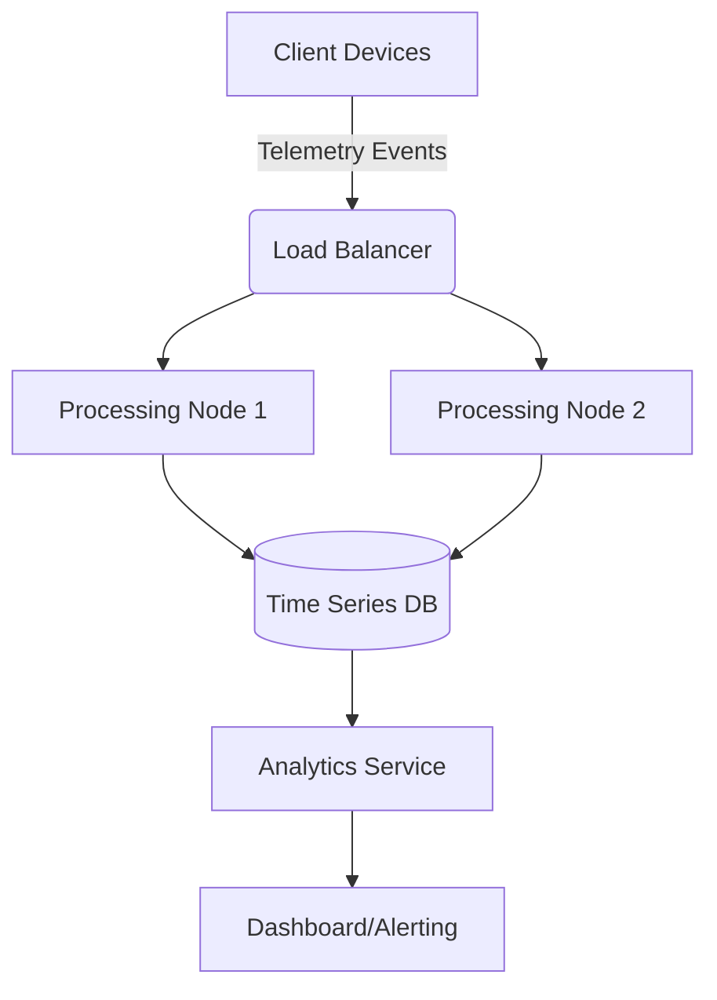
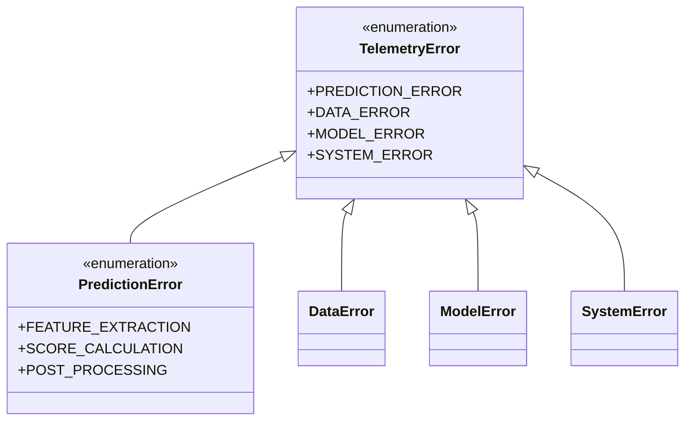
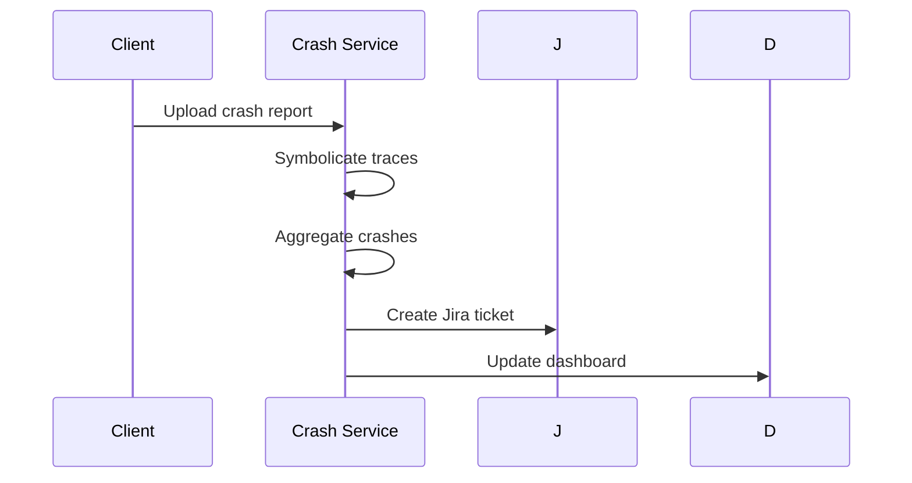

# HealthAI 2030 Telemetry System Implementation Plan

## 1. Remote Telemetry Processing System

**Technical Specifications**:
- Event ingestion API (REST/gRPC)
- Distributed processing cluster
- Time-series database (InfluxDB/TimeScaleDB)
- Analytics pipeline (Apache Flink/Spark)

**Dependencies**:
- Kubernetes cluster
- Message queue (Kafka/RabbitMQ)
- Monitoring stack (Prometheus/Grafana)

**Timeline**: 6-8 weeks  
**Risks**:
- Network latency
- Data consistency

## 2. Granular Error Categorization Hierarchy

**Implementation**:
- Extend `TelemetryEvent` with error hierarchy
- Error code registry
- Remediation action mapping

**Dependencies**: Existing telemetry system  
**Timeline**: 2-3 weeks  
**Risks**:
- Over-engineering
- Incomplete coverage

## 3. Enhanced Statistical Model Drift Detection

**Metrics**:
- Feature distribution shifts (KL divergence)
- Prediction distribution changes
- Performance degradation

**Alerting**:
- Multi-level thresholds
- Root cause analysis

**Dependencies**: Statistical libraries  
**Timeline**: 4-5 weeks  
**Risks**:
- False positives
- Computational overhead

## 4. Crash Reporting System Integration

**Components**:
- Crashpad reporter
- Symbol server
- Analysis service

**Dependencies**: Symbol server  
**Timeline**: 3-4 weeks  
**Risks**:
- Privacy concerns
- Duplicate reports

## Implementation Order
1. Error Categorization
2. Crash Reporting
3. Model Drift Detection
4. Remote Telemetry