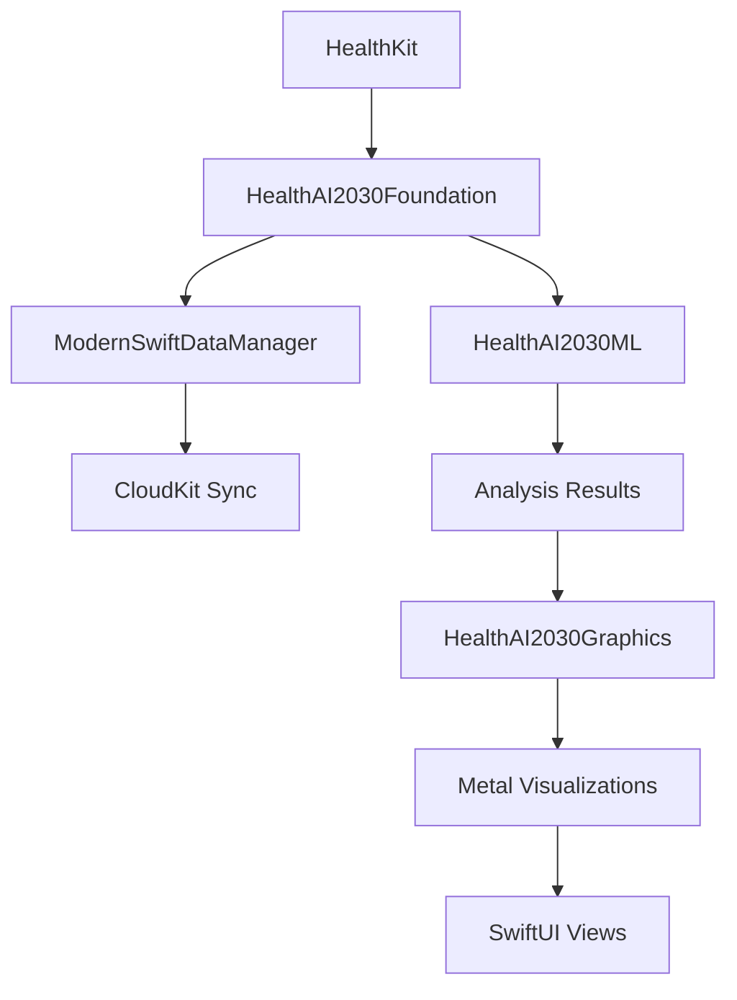

# HealthAI 2030 Developer Guide

## Complete Development Guide for iOS 18+ / macOS 15+ Health Intelligence Platform

This comprehensive guide will help you understand, contribute to, and extend the HealthAI 2030 platform using the latest Apple technologies.

## Table of Contents

- [Getting Started](#getting-started)
- [Architecture Overview](#architecture-overview)
- [Development Environment](#development-environment)
- [Core Technologies](#core-technologies)
- [Feature Development](#feature-development)
- [Testing Strategy](#testing-strategy)
- [Performance Optimization](#performance-optimization)
- [Privacy & Security](#privacy--security)
- [Deployment](#deployment)
- [Troubleshooting](#troubleshooting)

---

## Getting Started

### Prerequisites

Before diving into HealthAI 2030 development, ensure you have:

- **Xcode 16+** with iOS 18+ SDK
- **Apple Developer Account** with HealthKit entitlements
- **Physical iOS/watchOS devices** for health data testing
- **CloudKit Console access** for data schema management
- **Understanding of Swift 6** and modern concurrency patterns

### Quick Start

1. **Clone and Setup**
   ```bash
   git clone https://github.com/healthai2030/HealthAI2030.git
   cd HealthAI2030
   swift package resolve
   ```

2. **Configure Development Team**
   ```bash
   # Update DEVELOPMENT_TEAM in Configuration/BuildSettings-iOS18.xcconfig
   export DEVELOPMENT_TEAM="YOUR_TEAM_ID"
   ```

3. **Build and Run**
   ```bash
   # iOS Simulator
   xcodebuild -scheme HealthAI2030 -destination 'platform=iOS Simulator,name=iPhone 15 Pro'
   
   # Physical Device (required for HealthKit)
   xcodebuild -scheme HealthAI2030 -destination 'platform=iOS,id=YOUR_DEVICE_ID'
   ```

---

## Architecture Overview

### Modern Swift Package Architecture

HealthAI 2030 follows a modular architecture using Swift Package Manager for iOS 18+ compatibility:

```
HealthAI2030/
├── Packages/                   # Core Swift Packages
│   ├── HealthAI2030Foundation/ # Data models, HealthKit, SwiftData
│   ├── HealthAI2030ML/        # Machine learning and AI
│   ├── HealthAI2030Graphics/  # Metal 4 graphics and shaders
│   ├── HealthAI2030Core/      # Shared business logic
│   ├── HealthAI2030UI/        # SwiftUI components
│   └── HealthAI2030Networking/# API and sync layer
├── Apps/                      # Platform-specific apps
├── Modules/Features/          # Feature modules
└── Configuration/             # Build configurations
```

### Core Design Principles

1. **Privacy First** - All health data processing happens locally when possible
2. **Actor-Based Concurrency** - Swift 6 actors for thread-safe health data handling  
3. **Reactive Architecture** - SwiftUI + Observation framework for responsive UI
4. **Modular Design** - Feature-based modules for maintainability
5. **Performance Optimized** - Metal 4 compute shaders for intensive processing

### Data Flow Architecture



---

## Development Environment

### Xcode Configuration

#### Build Settings

Create platform-specific build configurations:

**iOS 18+ Configuration (`Configuration/BuildSettings-iOS18.xcconfig`)**
```xcconfig
IPHONEOS_DEPLOYMENT_TARGET = 18.0
SWIFT_VERSION = 6.0
SWIFT_UPCOMING_FEATURE_GLOBAL_CONCURRENCY = YES
SWIFT_UPCOMING_FEATURE_EXISTENTIAL_ANY = YES
MTL_ENABLE_DEBUG_INFO = INCLUDE_SOURCE
```

**macOS 15+ Configuration (`Configuration/BuildSettings-macOS15.xcconfig`)**
```xcconfig
MACOSX_DEPLOYMENT_TARGET = 15.0
ENABLE_HARDENED_RUNTIME = YES
ENABLE_APP_SANDBOX = YES
SWIFT_VERSION = 6.0
```

#### Scheme Configuration

Configure schemes for different development scenarios:

1. **HealthAI2030-Debug**: Full logging, debug symbols
2. **HealthAI2030-Performance**: Optimized builds for performance testing
3. **HealthAI2030-Privacy**: Privacy-compliant builds for App Store

### Environment Variables

Set up development environment variables:

```bash
# ~/.zshrc or ~/.bash_profile
export HEALTHAI_DEVELOPMENT_TEAM="YOUR_TEAM_ID"
export HEALTHAI_CLOUDKIT_CONTAINER="iCloud.com.healthai2030.HealthAI2030"
export HEALTHAI_DEBUG_LOGGING="1"
export METAL_DEVICE_WRAPPER_TYPE="1"  # Enable Metal debugging
```

### Required Entitlements

Ensure your development provisioning profile includes:

- HealthKit
- CloudKit
- App Groups
- Background App Refresh
- Core ML Private Model Access
- Metal Performance Shaders

---

## Core Technologies

### SwiftData with CloudKit Integration

#### Setting Up SwiftData Models

```swift
@available(iOS 18.0, macOS 15.0, watchOS 11.0, tvOS 18.0, visionOS 2.0, *)
@Model
public final class ModernHealthData {
    @Attribute(.unique) public var id: UUID
    public var timestamp: Date
    public var dataType: HealthDataType
    public var value: Double
    public var unit: String?
    
    // CloudKit relationship handling
    @Relationship(deleteRule: .cascade) 
    public var analysisResults: [AnalysisResult] = []
    
    public init(timestamp: Date, dataType: HealthDataType, value: Double) {
        self.id = UUID()
        self.timestamp = timestamp
        self.dataType = dataType
        self.value = value
    }
}
```

#### CloudKit Schema Configuration

Configure CloudKit schema programmatically:

```swift
private func setupCloudKitSchema() async throws {
    let container = CKContainer.default()
    let privateDB = container.privateCloudDatabase
    
    // Define record types that match SwiftData models
    let healthDataRecordType = CKRecordType("ModernHealthData")
    // CloudKit automatically syncs SwiftData @Model classes
}
```

### HealthKit Integration

#### Modern HealthKit Setup

```swift
@available(iOS 18.0, watchOS 11.0, *)
class HealthKitManager {
    private let healthStore = HKHealthStore()
    
    func requestAuthorization() async throws {
        let typesToRead: Set<HKSampleType> = [
            HKQuantityType(.heartRate),
            HKQuantityType(.heartRateVariabilitySDNN),
            HKQuantityType(.oxygenSaturation),
            HKQuantityType(.respiratoryRate),
            HKCategoryType(.sleepAnalysis),
            // iOS 18+ specific types
            HKQuantityType(.environmentalAudioExposure)
        ]
        
        try await healthStore.requestAuthorization(toShare: [], read: typesToRead)
    }
    
    func observeHealthChanges() {
        let heartRateType = HKQuantityType(.heartRate)
        let query = HKObserverQuery(sampleType: heartRateType, predicate: nil) { _, _, error in
            if let error = error {
                print("Observer query error: \(error)")
                return
            }
            
            Task {
                await self.processNewHeartRateData()
            }
        }
        
        healthStore.execute(query)
        healthStore.enableBackgroundDelivery(for: heartRateType, frequency: .immediate) { _, error in
            if let error = error {
                print("Background delivery error: \(error)")
            }
        }
    }
}
```

### Metal 4 Graphics Programming

#### Health Shader Development

Create health-specific Metal shaders in `Packages/HealthAI2030Graphics/Sources/HealthAI2030Graphics/Shaders/`:

**Heart Rate Visualization Shader (`HealthShaders.metal`)**
```metal
#include <metal_stdlib>
using namespace metal;

struct VertexOut {
    float4 position [[position]];
    float2 texCoord;
};

struct HeartRateUniforms {
    float time;
    float heartRate;
    float heartRateVariability;
    float4 color;
};

fragment float4 heart_rate_pulse_fragment(
    VertexOut in [[stage_in]],
    constant HeartRateUniforms& uniforms [[buffer(0)]]
) {
    float2 coord = in.texCoord;
    
    // Create pulsing effect based on heart rate
    float pulse = sin(uniforms.time * (uniforms.heartRate / 60.0) * 2.0 * M_PI_F);
    float intensity = (pulse + 1.0) * 0.5;
    
    // Add HRV-based color variation
    float3 baseColor = uniforms.color.rgb;
    float3 finalColor = baseColor * intensity * (uniforms.heartRateVariability / 50.0);
    
    return float4(finalColor, 1.0);
}
```

#### Metal Compute for Health Analysis

```swift
class HealthMetalCompute {
    private let device: MTLDevice
    private let commandQueue: MTLCommandQueue
    private let computePipeline: MTLComputePipelineState
    
    init() throws {
        guard let device = MTLCreateSystemDefaultDevice() else {
            throw GraphicsError.metalUnavailable
        }
        self.device = device
        
        guard let commandQueue = device.makeCommandQueue() else {
            throw GraphicsError.commandQueueCreationFailed
        }
        self.commandQueue = commandQueue
        
        let library = try device.makeDefaultLibrary(bundle: .module)
        let function = library.makeFunction(name: "health_data_analysis")!
        self.computePipeline = try device.makeComputePipelineState(function: function)
    }
    
    func analyzeHealthData(_ data: [Float]) async throws -> [Float] {
        let dataSize = data.count * MemoryLayout<Float>.size
        
        guard let inputBuffer = device.makeBuffer(bytes: data, length: dataSize) else {
            throw GraphicsError.bufferCreationFailed
        }
        
        guard let outputBuffer = device.makeBuffer(length: dataSize) else {
            throw GraphicsError.bufferCreationFailed
        }
        
        let commandBuffer = commandQueue.makeCommandBuffer()!
        let computeEncoder = commandBuffer.makeComputeCommandEncoder()!
        
        computeEncoder.setComputePipelineState(computePipeline)
        computeEncoder.setBuffer(inputBuffer, offset: 0, index: 0)
        computeEncoder.setBuffer(outputBuffer, offset: 0, index: 1)
        
        let threadGroupSize = MTLSize(width: 64, height: 1, depth: 1)
        let threadGroups = MTLSize(
            width: (data.count + threadGroupSize.width - 1) / threadGroupSize.width,
            height: 1,
            depth: 1
        )
        
        computeEncoder.dispatchThreadgroups(threadGroups, threadsPerThreadgroup: threadGroupSize)
        computeEncoder.endEncoding()
        
        commandBuffer.commit()
        commandBuffer.waitUntilCompleted()
        
        let resultPointer = outputBuffer.contents().bindMemory(to: Float.self, capacity: data.count)
        return Array(UnsafeBufferPointer(start: resultPointer, count: data.count))
    }
}
```

### Machine Learning Integration

#### iOS 18+ SpeechAnalyzer Integration

```swift
@available(iOS 18.0, *)
class VoiceStressAnalyzer {
    private var speechAnalyzer: SFSpeechAnalyzer?
    
    func initializeSpeechAnalyzer() async throws {
        let authStatus = await SFSpeechRecognizer.requestAuthorization()
        guard authStatus == .authorized else {
            throw MLAnalysisError.permissionDenied
        }
        
        speechAnalyzer = SFSpeechAnalyzer()
    }
    
    func analyzeVoiceStress(audioURL: URL) async throws -> VoiceStressResult {
        guard let analyzer = speechAnalyzer else {
            throw MLAnalysisError.analyzerNotInitialized
        }
        
        // Create analysis request
        let request = SFSpeechAnalysisRequest(url: audioURL)
        request.addsPunctuation = false
        request.requiresOnDeviceRecognition = true  // Privacy-first approach
        
        // Perform analysis
        let analysis = try await analyzer.analyze(request)
        
        // Extract stress indicators from speech patterns
        let stressLevel = extractStressFromSpeechFeatures(analysis)
        
        return VoiceStressResult(
            stressLevel: stressLevel,
            confidence: analysis.confidence,
            speechRate: analysis.speechRate,
            voiceTremor: analysis.voiceTremor
        )
    }
    
    private func extractStressFromSpeechFeatures(_ analysis: SFSpeechAnalysisResult) -> Double {
        // Implement stress extraction algorithm
        let normalizedSpeechRate = min(analysis.speechRate / 200.0, 1.0)  // words per minute
        let tremorFactor = analysis.voiceTremor
        let confidenceFactor = 1.0 - analysis.confidence
        
        return (normalizedSpeechRate * 0.4 + tremorFactor * 0.4 + confidenceFactor * 0.2)
    }
}
```

#### CoreML Model Integration

```swift
class HealthMLPredictor {
    private var heartRateModel: MLModel?
    private var sleepStageModel: MLModel?
    
    func loadModels() async throws {
        // Load compiled CoreML models
        guard let heartRateModelURL = Bundle.module.url(forResource: "HeartRateAnomaly", withExtension: "mlmodelc"),
              let sleepStageModelURL = Bundle.module.url(forResource: "SleepStageClassifier", withExtension: "mlmodelc") else {
            throw MLAnalysisError.modelNotFound
        }
        
        heartRateModel = try await MLModel(contentsOf: heartRateModelURL)
        sleepStageModel = try await MLModel(contentsOf: sleepStageModelURL)
    }
    
    func predictHeartRateAnomaly(heartRateSequence: [Double]) async throws -> HeartRateAnomalyResult {
        guard let model = heartRateModel else {
            throw MLAnalysisError.modelNotLoaded
        }
        
        // Prepare input features
        let inputArray = try MLMultiArray(shape: [1, NSNumber(value: heartRateSequence.count)], dataType: .double)
        for (index, value) in heartRateSequence.enumerated() {
            inputArray[index] = NSNumber(value: value)
        }
        
        let input = HeartRateAnomalyInput(heartRateSequence: inputArray)
        let prediction = try await model.prediction(from: input)
        
        guard let output = prediction.featureValue(for: "anomalyScore")?.doubleValue else {
            throw MLAnalysisError.predictionFailed
        }
        
        return HeartRateAnomalyResult(
            isAnomaly: output > 0.7,
            anomalyScore: output,
            confidence: prediction.featureValue(for: "confidence")?.doubleValue ?? 0.0
        )
    }
}
```

---

## Feature Development

### Creating a New Health Feature

Follow this step-by-step process to add new health monitoring features:

#### 1. Define Data Models

Create SwiftData models in `HealthAI2030Foundation`:

```swift
@available(iOS 18.0, macOS 15.0, watchOS 11.0, tvOS 18.0, visionOS 2.0, *)
@Model
public final class BloodPressureReading {
    @Attribute(.unique) public var id: UUID
    public var timestamp: Date
    public var systolic: Double
    public var diastolic: Double
    public var pulse: Double?
    public var deviceSource: String?
    
    @Relationship public var healthData: ModernHealthData?
    
    public init(systolic: Double, diastolic: Double, pulse: Double? = nil) {
        self.id = UUID()
        self.timestamp = Date()
        self.systolic = systolic
        self.diastolic = diastolic
        self.pulse = pulse
    }
}
```

#### 2. Implement HealthKit Integration

Add HealthKit data collection:

```swift
extension HealthKitManager {
    func collectBloodPressure() async throws -> [BloodPressureReading] {
        let systolicType = HKQuantityType(.bloodPressureSystolic)
        let diastolicType = HKQuantityType(.bloodPressureDiastolic)
        
        // Create correlation query for blood pressure
        let predicate = HKQuery.predicateForSamples(
            withStart: Calendar.current.date(byAdding: .day, value: -7, to: Date()),
            end: Date()
        )
        
        return try await withCheckedThrowingContinuation { continuation in
            let query = HKCorrelationQuery(
                type: HKCorrelationType(.bloodPressure),
                predicate: predicate
            ) { _, samples, error in
                if let error = error {
                    continuation.resume(throwing: error)
                    return
                }
                
                let readings = samples?.compactMap { sample -> BloodPressureReading? in
                    guard let correlation = sample as? HKCorrelation else { return nil }
                    
                    let systolic = correlation.objects(for: systolicType).first as? HKQuantitySample
                    let diastolic = correlation.objects(for: diastolicType).first as? HKQuantitySample
                    
                    guard let systolicValue = systolic?.quantity.doubleValue(for: .millimeterOfMercury()),
                          let diastolicValue = diastolic?.quantity.doubleValue(for: .millimeterOfMercury()) else {
                        return nil
                    }
                    
                    return BloodPressureReading(systolic: systolicValue, diastolic: diastolicValue)
                } ?? []
                
                continuation.resume(returning: readings)
            }
            
            healthStore.execute(query)
        }
    }
}
```

#### 3. Add ML Analysis

Implement machine learning analysis for the new feature:

```swift
extension HealthAI2030ML {
    func analyzeBloodPressureTrends(
        readings: [BloodPressureReading]
    ) async throws -> BloodPressureAnalysisResult {
        
        // Prepare data for analysis
        let systolicValues = readings.map { $0.systolic }
        let diastolicValues = readings.map { $0.diastolic }
        
        // Detect hypertension patterns
        let hypertensionRisk = calculateHypertensionRisk(
            systolic: systolicValues,
            diastolic: diastolicValues
        )
        
        // Trend analysis
        let trend = analyzeTrend(systolicValues)
        
        return BloodPressureAnalysisResult(
            hypertensionRisk: hypertensionRisk,
            trend: trend,
            averageSystolic: systolicValues.reduce(0, +) / Double(systolicValues.count),
            averageDiastolic: diastolicValues.reduce(0, +) / Double(diastolicValues.count)
        )
    }
    
    private func calculateHypertensionRisk(systolic: [Double], diastolic: [Double]) -> Double {
        let highSystolicCount = systolic.filter { $0 >= 140 }.count
        let highDiastolicCount = diastolic.filter { $0 >= 90 }.count
        
        let totalReadings = max(systolic.count, diastolic.count)
        let riskPercentage = max(highSystolicCount, highDiastolicCount) / totalReadings
        
        return Double(riskPercentage)
    }
}
```

#### 4. Create Visualizations

Add Metal-powered visualizations:

```swift
extension HealthAI2030Graphics {
    func renderBloodPressureTrendChart(
        readings: [BloodPressureReading],
        size: CGSize
    ) async throws -> MTLTexture? {
        
        let renderPassDescriptor = MTLRenderPassDescriptor()
        guard let texture = createTexture(size: size) else { return nil }
        
        renderPassDescriptor.colorAttachments[0].texture = texture
        renderPassDescriptor.colorAttachments[0].loadAction = .clear
        renderPassDescriptor.colorAttachments[0].clearColor = MTLClearColor(red: 0, green: 0, blue: 0, alpha: 1)
        
        let commandBuffer = commandQueue.makeCommandBuffer()!
        let renderEncoder = commandBuffer.makeRenderCommandEncoder(descriptor: renderPassDescriptor)!
        
        // Set up vertex data for blood pressure chart
        let vertices = createBloodPressureVertices(readings)
        let vertexBuffer = device.makeBuffer(bytes: vertices, length: vertices.count * MemoryLayout<Vertex>.size)
        
        renderEncoder.setRenderPipelineState(bloodPressureRenderPipeline)
        renderEncoder.setVertexBuffer(vertexBuffer, offset: 0, index: 0)
        renderEncoder.drawPrimitives(type: .lineStrip, vertexStart: 0, vertexCount: vertices.count)
        
        renderEncoder.endEncoding()
        commandBuffer.commit()
        commandBuffer.waitUntilCompleted()
        
        return texture
    }
}
```

#### 5. Build SwiftUI Interface

Create responsive SwiftUI views:

```swift
struct BloodPressureMonitorView: View {
    @State private var readings: [BloodPressureReading] = []
    @State private var analysisResult: BloodPressureAnalysisResult?
    @State private var chartTexture: MTLTexture?
    
    private let healthML = HealthAI2030ML.shared
    private let graphics = try! HealthAI2030Graphics()
    
    var body: some View {
        NavigationView {
            VStack(spacing: 20) {
                // Risk Status Card
                if let analysis = analysisResult {
                    BloodPressureRiskCard(analysis: analysis)
                }
                
                // Real-time Chart
                MetalView(texture: chartTexture)
                    .frame(height: 300)
                    .clipShape(RoundedRectangle(cornerRadius: 12))
                
                // Recent Readings List
                BloodPressureReadingsList(readings: readings)
                
                Spacer()
            }
            .padding()
            .navigationTitle("Blood Pressure")
            .task {
                await loadBloodPressureData()
            }
        }
    }
    
    private func loadBloodPressureData() async {
        do {
            // Load from HealthKit
            readings = try await HealthKitManager.shared.collectBloodPressure()
            
            // Perform ML analysis
            analysisResult = try await healthML.analyzeBloodPressureTrends(readings: readings)
            
            // Generate visualization
            chartTexture = try await graphics.renderBloodPressureTrendChart(
                readings: readings,
                size: CGSize(width: 400, height: 300)
            )
            
        } catch {
            print("Failed to load blood pressure data: \(error)")
        }
    }
}
```

### Testing New Features

#### Unit Testing Health Features

```swift
@testable import HealthAI2030Foundation
@testable import HealthAI2030ML

final class BloodPressureAnalysisTests: XCTestCase {
    
    func testHypertensionRiskCalculation() async throws {
        let ml = HealthAI2030ML.shared
        
        // Test data with high blood pressure readings
        let highReadings = [
            BloodPressureReading(systolic: 150, diastolic: 95),
            BloodPressureReading(systolic: 145, diastolic: 92),
            BloodPressureReading(systolic: 155, diastolic: 98)
        ]
        
        let result = try await ml.analyzeBloodPressureTrends(readings: highReadings)
        
        XCTAssertGreaterThan(result.hypertensionRisk, 0.8, "High BP readings should indicate high risk")
        XCTAssertEqual(result.trend, .increasing, "Consistently high readings should show increasing trend")
    }
    
    func testNormalBloodPressure() async throws {
        let ml = HealthAI2030ML.shared
        
        let normalReadings = [
            BloodPressureReading(systolic: 120, diastolic: 80),
            BloodPressureReading(systolic: 118, diastolic: 78),
            BloodPressureReading(systolic: 122, diastolic: 82)
        ]
        
        let result = try await ml.analyzeBloodPressureTrends(readings: normalReadings)
        
        XCTAssertLessThan(result.hypertensionRisk, 0.3, "Normal BP readings should indicate low risk")
    }
}
```

#### Integration Testing

```swift
final class BloodPressureIntegrationTests: XCTestCase {
    
    func testCompleteBloodPressureWorkflow() async throws {
        let foundation = HealthAI2030Foundation.shared
        let dataManager = ModernSwiftDataManager.shared
        let ml = HealthAI2030ML.shared
        
        // Initialize systems
        try await foundation.initialize()
        await dataManager.initialize()
        
        // Create test data
        let testReading = BloodPressureReading(systolic: 130, diastolic: 85)
        
        // Save to SwiftData
        try await dataManager.save(testReading)
        
        // Retrieve and analyze
        let savedReadings = try await dataManager.fetch(BloodPressureReading.self)
        let analysis = try await ml.analyzeBloodPressureTrends(readings: savedReadings)
        
        XCTAssertFalse(savedReadings.isEmpty, "Reading should be saved")
        XCTAssertNotNil(analysis, "Analysis should be performed")
    }
}
```

---

## Testing Strategy

### Comprehensive Testing Approach

HealthAI 2030 uses a multi-layered testing strategy:

1. **Unit Tests** - Individual component testing
2. **Integration Tests** - Cross-component interaction testing  
3. **UI Tests** - End-to-end user experience testing
4. **Performance Tests** - Metal compute and ML inference benchmarking
5. **Privacy Tests** - Data handling and privacy compliance verification

### Health Data Testing

#### Simulated Health Data Generation

```swift
class HealthDataSimulator {
    static func generateHeartRateSequence(
        baseRate: Double = 72.0,
        variability: Double = 10.0,
        duration: TimeInterval = 3600,
        samplingRate: TimeInterval = 5.0
    ) -> [ModernHealthData] {
        
        var healthData: [ModernHealthData] = []
        let sampleCount = Int(duration / samplingRate)
        
        for i in 0..<sampleCount {
            let time = Date().addingTimeInterval(-duration + Double(i) * samplingRate)
            
            // Add realistic variability
            let noise = Double.random(in: -variability...variability)
            let circadianEffect = sin(Double(i) * 2 * .pi / (24 * 3600 / samplingRate)) * 5
            let heartRate = baseRate + noise + circadianEffect
            
            let data = ModernHealthData(
                timestamp: time,
                dataType: .heartRate,
                value: max(40, min(200, heartRate)),
                unit: "bpm",
                deviceSource: "Simulator"
            )
            healthData.append(data)
        }
        
        return healthData
    }
    
    static func generateSleepData(sleepDuration: TimeInterval = 8 * 3600) -> [ModernHealthData] {
        let sleepStages: [SleepStage] = [.awake, .light, .deep, .rem]
        var sleepData: [ModernHealthData] = []
        
        let stageCount = 16  // 30-minute intervals
        let stageDuration = sleepDuration / Double(stageCount)
        
        for i in 0..<stageCount {
            let stageTime = Date().addingTimeInterval(-sleepDuration + Double(i) * stageDuration)
            let stage = sleepStages.randomElement()!
            
            let data = ModernHealthData(
                timestamp: stageTime,
                dataType: .sleepAnalysis,
                value: Double(stage.rawValue),
                unit: "stage"
            )
            sleepData.append(data)
        }
        
        return sleepData
    }
}
```

#### Performance Testing

```swift
final class PerformanceTests: XCTestCase {
    
    func testMetalComputePerformance() throws {
        let graphics = try HealthAI2030Graphics()
        let testData = Array(repeating: Float.random(in: 0...200), count: 10000)
        
        measure {
            // Test Metal compute shader performance
            let expectation = XCTestExpectation(description: "Metal compute")
            
            Task {
                do {
                    let result = try await graphics.processHealthDataOnGPU(testData)
                    XCTAssertEqual(result.count, testData.count)
                    expectation.fulfill()
                } catch {
                    XCTFail("Metal compute failed: \(error)")
                }
            }
            
            wait(for: [expectation], timeout: 5.0)
        }
    }
    
    func testMLInferencePerformance() throws {
        let ml = HealthAI2030ML.shared
        let heartRateData = Array(repeating: 75.0, count: 100)
        
        measure {
            let expectation = XCTestExpectation(description: "ML inference")
            
            Task {
                do {
                    let result = try await ml.detectHeartRateAnomaly(heartRateSequence: heartRateData)
                    XCTAssertNotNil(result)
                    expectation.fulfill()
                } catch {
                    XCTFail("ML inference failed: \(error)")
                }
            }
            
            wait(for: [expectation], timeout: 10.0)
        }
    }
}
```

### Privacy Compliance Testing

```swift
final class PrivacyComplianceTests: XCTestCase {
    
    func testDataExportCompliance() async throws {
        let dataManager = ModernSwiftDataManager.shared
        await dataManager.initialize()
        
        // Add test health data
        let testData = HealthDataSimulator.generateHeartRateSequence()
        for data in testData {
            try await dataManager.save(data)
        }
        
        // Test data export
        let exportedData = try await dataManager.exportUserData()
        
        // Verify exported data is complete and properly formatted
        XCTAssertFalse(exportedData.isEmpty, "Exported data should not be empty")
        
        let decoder = JSONDecoder()
        decoder.dateDecodingStrategy = .iso8601
        let userExport = try decoder.decode(UserDataExport.self, from: exportedData)
        
        XCTAssertEqual(userExport.healthData.count, testData.count, "All health data should be exported")
    }
    
    func testDataDeletion() async throws {
        let dataManager = ModernSwiftDataManager.shared
        
        // Add test data
        let testData = ModernHealthData(
            timestamp: Date(),
            dataType: .heartRate,
            value: 75.0
        )
        try await dataManager.save(testData)
        
        // Verify data exists
        let beforeDeletion = try await dataManager.fetch(ModernHealthData.self)
        XCTAssertFalse(beforeDeletion.isEmpty)
        
        // Delete all data
        try await dataManager.deleteAllUserData()
        
        // Verify data is deleted
        let afterDeletion = try await dataManager.fetch(ModernHealthData.self)
        XCTAssertTrue(afterDeletion.isEmpty, "All user data should be deleted")
    }
}
```

---

## Performance Optimization

### Metal 4 Optimization Strategies

#### Compute Shader Optimization

```metal
// Optimized health data processing shader
kernel void optimized_health_analysis(
    device const float* inputData [[buffer(0)]],
    device float* outputData [[buffer(1)]],
    constant uint& dataCount [[buffer(2)]],
    uint index [[thread_position_in_grid]]
) {
    if (index >= dataCount) return;
    
    // Use local memory for better cache performance
    threadgroup float localCache[64];
    
    uint localIndex = index % 64;
    localCache[localIndex] = inputData[index];
    
    threadgroup_barrier(mem_flags::mem_threadgroup);
    
    // Perform analysis using vectorized operations
    float4 data = float4(
        localCache[max(0, int(localIndex) - 1)],
        localCache[localIndex],
        localCache[min(63, localIndex + 1)],
        localCache[min(63, localIndex + 2)]
    );
    
    // Apply health-specific analysis
    float trend = dot(data, float4(-1, -0.5, 0.5, 1)) / 2.5;
    float variability = length(data - dot(data, float4(0.25))) / 4.0;
    
    outputData[index] = trend + variability;
}
```

#### Memory Management Optimization

```swift
class OptimizedHealthDataProcessor {
    private let metalDevice: MTLDevice
    private let commandQueue: MTLCommandQueue
    private var bufferPool: [MTLBuffer] = []
    
    func processLargeHealthDataset(_ data: [Float]) async throws -> [Float] {
        // Use buffer pooling to reduce allocation overhead
        let buffer = getPooledBuffer(size: data.count * MemoryLayout<Float>.size)
        defer { returnBufferToPool(buffer) }
        
        // Process data in chunks for better memory efficiency
        let chunkSize = 1024
        var results: [Float] = []
        results.reserveCapacity(data.count)
        
        for chunkStart in stride(from: 0, to: data.count, by: chunkSize) {
            let chunkEnd = min(chunkStart + chunkSize, data.count)
            let chunk = Array(data[chunkStart..<chunkEnd])
            
            let chunkResult = try await processChunk(chunk, using: buffer)
            results.append(contentsOf: chunkResult)
        }
        
        return results
    }
    
    private func getPooledBuffer(size: Int) -> MTLBuffer {
        for buffer in bufferPool where buffer.length >= size {
            bufferPool.removeAll { $0 === buffer }
            return buffer
        }
        
        return metalDevice.makeBuffer(length: size, options: .storageModeShared)!
    }
    
    private func returnBufferToPool(_ buffer: MTLBuffer) {
        if bufferPool.count < 10 {  // Limit pool size
            bufferPool.append(buffer)
        }
    }
}
```

### SwiftData Performance Optimization

#### Efficient Querying

```swift
extension ModernSwiftDataManager {
    // Optimized health data queries with proper indexing
    func getHealthDataEfficiently(
        type: HealthDataType,
        dateRange: DateInterval,
        limit: Int = 1000
    ) async throws -> [ModernHealthData] {
        
        // Use predicate for database-level filtering
        let predicate = #Predicate<ModernHealthData> { data in
            data.dataType == type &&
            data.timestamp >= dateRange.start &&
            data.timestamp <= dateRange.end
        }
        
        // Sort and limit at database level
        let sortDescriptor = SortDescriptor<ModernHealthData>(\.timestamp, order: .reverse)
        
        var descriptor = FetchDescriptor<ModernHealthData>(
            predicate: predicate,
            sortBy: [sortDescriptor]
        )
        descriptor.fetchLimit = limit
        
        return try await fetch(ModernHealthData.self, descriptor: descriptor)
    }
    
    // Batch processing for large datasets
    func processHealthDataInBatches(
        batchSize: Int = 500,
        processor: @escaping ([ModernHealthData]) async throws -> Void
    ) async throws {
        
        var offset = 0
        var hasMoreData = true
        
        while hasMoreData {
            var descriptor = FetchDescriptor<ModernHealthData>()
            descriptor.fetchOffset = offset
            descriptor.fetchLimit = batchSize
            descriptor.sortBy = [SortDescriptor(\.timestamp)]
            
            let batch = try await fetch(ModernHealthData.self, descriptor: descriptor)
            
            if batch.isEmpty {
                hasMoreData = false
            } else {
                try await processor(batch)
                offset += batchSize
            }
        }
    }
}
```

### ML Performance Optimization

#### Model Optimization

```swift
class OptimizedMLPredictor {
    private let compiledModel: MLModel
    private let predictionQueue: DispatchQueue
    
    init() throws {
        // Use compiled model for better performance
        let compiledModelURL = try MLModel.compileModel(at: modelURL)
        self.compiledModel = try MLModel(contentsOf: compiledModelURL)
        
        // Dedicated queue for ML operations
        self.predictionQueue = DispatchQueue(
            label: "health.ml.prediction",
            qos: .userInteractive,
            attributes: .concurrent
        )
    }
    
    func batchPredict(inputs: [MLFeatureProvider]) async throws -> [MLFeatureProvider] {
        // Use batch prediction for better throughput
        let batchInput = MLArrayBatchProvider(array: inputs)
        let batchOutput = try await withCheckedThrowingContinuation { continuation in
            predictionQueue.async {
                do {
                    let output = try self.compiledModel.predictions(from: batchInput)
                    continuation.resume(returning: output)
                } catch {
                    continuation.resume(throwing: error)
                }
            }
        }
        
        return (0..<batchOutput.count).map { batchOutput.features(at: $0) }
    }
}
```

---

## Privacy & Security

### Privacy-First Development

#### Local Processing Strategy

```swift
// Ensure health analysis happens on-device
class PrivacyAwareHealthProcessor {
    private let localMLProcessor = LocalMLProcessor()
    private let deviceOnlyAnalyzer = DeviceOnlyHealthAnalyzer()
    
    func analyzeHealthDataPrivately(_ data: [ModernHealthData]) async throws -> HealthAnalysisResult {
        // All processing happens locally - no cloud requests
        let heartRateData = data.filter { $0.dataType == .heartRate }
        let sleepData = data.filter { $0.dataType == .sleepAnalysis }
        
        // On-device ML inference only
        let heartAnalysis = try await localMLProcessor.analyzeHeartRate(heartRateData)
        let sleepAnalysis = try await localMLProcessor.analyzeSleep(sleepData)
        
        // Combine results locally
        return HealthAnalysisResult(
            heartRateAnalysis: heartAnalysis,
            sleepAnalysis: sleepAnalysis,
            processedOnDevice: true,
            timestamp: Date()
        )
    }
}
```

#### Data Encryption

```swift
import CryptoKit

class HealthDataEncryption {
    private let symmetricKey: SymmetricKey
    
    init() {
        // Generate or retrieve key from Keychain
        if let existingKey = KeychainManager.retrieveHealthDataKey() {
            self.symmetricKey = existingKey
        } else {
            self.symmetricKey = SymmetricKey(size: .bits256)
            KeychainManager.storeHealthDataKey(symmetricKey)
        }
    }
    
    func encryptHealthData(_ data: Data) throws -> Data {
        let sealedBox = try ChaChaPoly.seal(data, using: symmetricKey)
        return sealedBox.combined
    }
    
    func decryptHealthData(_ encryptedData: Data) throws -> Data {
        let sealedBox = try ChaChaPoly.SealedBox(combined: encryptedData)
        return try ChaChaPoly.open(sealedBox, using: symmetricKey)
    }
}

class KeychainManager {
    static func storeHealthDataKey(_ key: SymmetricKey) {
        let keyData = key.withUnsafeBytes { Data($0) }
        
        let query: [String: Any] = [
            kSecClass as String: kSecClassGenericPassword,
            kSecAttrAccount as String: "health_data_encryption_key",
            kSecAttrService as String: "com.healthai2030.encryption",
            kSecValueData as String: keyData,
            kSecAttrAccessible as String: kSecAttrAccessibleWhenUnlockedThisDeviceOnly
        ]
        
        SecItemAdd(query as CFDictionary, nil)
    }
    
    static func retrieveHealthDataKey() -> SymmetricKey? {
        let query: [String: Any] = [
            kSecClass as String: kSecClassGenericPassword,
            kSecAttrAccount as String: "health_data_encryption_key",
            kSecAttrService as String: "com.healthai2030.encryption",
            kSecReturnData as String: true
        ]
        
        var result: AnyObject?
        let status = SecItemCopyMatching(query as CFDictionary, &result)
        
        guard status == errSecSuccess, let keyData = result as? Data else {
            return nil
        }
        
        return SymmetricKey(data: keyData)
    }
}
```

### Security Best Practices

#### App Attest Implementation

```swift
@available(iOS 18.0, *)
class AppAttestManager {
    private let service = DCAppAttestService.shared
    
    func attestApp() async throws -> String {
        guard service.isSupported else {
            throw SecurityError.appAttestNotSupported
        }
        
        // Generate key
        let keyId = try await service.generateKey()
        
        // Create attestation
        let challenge = Data("health_data_challenge".utf8)
        let attestation = try await service.attestKey(keyId, clientDataHash: challenge.sha256)
        
        // Send to server for verification
        // ... server verification logic
        
        return keyId
    }
    
    func generateAssertion(for keyId: String, clientData: Data) async throws -> Data {
        let clientDataHash = SHA256.hash(data: clientData)
        return try await service.generateAssertion(keyId, clientDataHash: Data(clientDataHash))
    }
}
```

#### Network Security

```swift
class SecureNetworkManager {
    private let session: URLSession
    
    init() {
        let configuration = URLSessionConfiguration.default
        configuration.tlsMinimumSupportedProtocolVersion = .TLSv13
        configuration.tlsMaximumSupportedProtocolVersion = .TLSv13
        
        self.session = URLSession(
            configuration: configuration,
            delegate: SecurityDelegate(),
            delegateQueue: nil
        )
    }
}

class SecurityDelegate: NSObject, URLSessionDelegate {
    func urlSession(
        _ session: URLSession,
        didReceive challenge: URLAuthenticationChallenge,
        completionHandler: @escaping (URLSession.AuthChallengeDisposition, URLCredential?) -> Void
    ) {
        // Implement certificate pinning
        guard let serverTrust = challenge.protectionSpace.serverTrust else {
            completionHandler(.cancelAuthenticationChallenge, nil)
            return
        }
        
        // Verify certificate against pinned certificates
        if CertificatePinner.verifyServerTrust(serverTrust) {
            completionHandler(.useCredential, URLCredential(trust: serverTrust))
        } else {
            completionHandler(.cancelAuthenticationChallenge, nil)
        }
    }
}
```

---

## Deployment

### App Store Preparation

#### Privacy Manifest

Ensure `PrivacyInfo.xcprivacy` is complete:

```xml
<?xml version="1.0" encoding="UTF-8"?>
<!DOCTYPE plist PUBLIC "-//Apple//DTD PLIST 1.0//EN" "http://www.apple.com/DTDs/PropertyList-1.0.dtd">
<plist version="1.0">
<dict>
    <key>NSPrivacyCollectedDataTypes</key>
    <array>
        <dict>
            <key>NSPrivacyCollectedDataType</key>
            <string>NSPrivacyCollectedDataTypeHealthFitness</string>
            <key>NSPrivacyCollectedDataTypeLinked</key>
            <true/>
            <key>NSPrivacyCollectedDataTypeTracking</key>
            <false/>
            <key>NSPrivacyCollectedDataTypePurposes</key>
            <array>
                <string>NSPrivacyCollectedDataTypePurposeHealthResearch</string>
                <string>NSPrivacyCollectedDataTypePurposePersonalizedRecommendations</string>
            </array>
        </dict>
    </array>
    <key>NSPrivacyAccessedAPITypes</key>
    <array>
        <dict>
            <key>NSPrivacyAccessedAPIType</key>
            <string>NSPrivacyAccessedAPICategoryUserDefaults</string>
            <key>NSPrivacyAccessedAPITypeReasons</key>
            <array>
                <string>CA92.1</string>
            </array>
        </dict>
    </array>
</dict>
</plist>
```

#### Build Scripts

Create automated build scripts for different environments:

```bash
#!/bin/bash
# Scripts/build_release.sh

set -e

echo "Building HealthAI 2030 for App Store release..."

# Clean build folder
rm -rf build/
mkdir -p build/

# Set environment variables
export CONFIGURATION=Release
export DEVELOPMENT_TEAM="YOUR_TEAM_ID"
export CODE_SIGN_STYLE=Automatic

# Build iOS app
xcodebuild \
    -scheme HealthAI2030 \
    -configuration Release \
    -destination 'generic/platform=iOS' \
    -archivePath build/HealthAI2030-iOS.xcarchive \
    archive

# Build macOS app
xcodebuild \
    -scheme HealthAI2030-macOS \
    -configuration Release \
    -destination 'generic/platform=macOS' \
    -archivePath build/HealthAI2030-macOS.xcarchive \
    archive

# Export for App Store
xcodebuild \
    -exportArchive \
    -archivePath build/HealthAI2030-iOS.xcarchive \
    -exportPath build/iOS-AppStore \
    -exportOptionsPlist Configuration/ExportOptions-AppStore.plist

echo "Build completed successfully!"
```

### CI/CD Pipeline

#### GitHub Actions Configuration

```yaml
# .github/workflows/ci.yml
name: HealthAI 2030 CI/CD

on:
  push:
    branches: [ main, develop ]
  pull_request:
    branches: [ main ]

jobs:
  test:
    runs-on: macos-14
    steps:
    - uses: actions/checkout@v4
    
    - name: Setup Xcode
      uses: maxim-lobanov/setup-xcode@v1
      with:
        xcode-version: '16.0'
    
    - name: Swift Package Resolution
      run: swift package resolve
    
    - name: Run Tests
      run: |
        swift test --parallel
        xcodebuild test \
          -scheme HealthAI2030 \
          -destination 'platform=iOS Simulator,name=iPhone 15 Pro'
    
    - name: Run Performance Tests
      run: |
        xcodebuild test \
          -scheme HealthAI2030 \
          -destination 'platform=iOS Simulator,name=iPhone 15 Pro' \
          -testPlan PerformanceTests
          
  privacy-audit:
    runs-on: macos-14
    steps:
    - uses: actions/checkout@v4
    
    - name: Privacy Manifest Validation
      run: |
        # Validate privacy manifest completeness
        python3 Scripts/validate_privacy_manifest.py
        
    - name: Data Flow Analysis
      run: |
        # Analyze data flows for privacy compliance
        swift run DataFlowAnalyzer
        
  security-scan:
    runs-on: macos-14
    steps:
    - uses: actions/checkout@v4
    
    - name: Security Scan
      run: |
        # Run security analysis tools
        swift run SecurityScanner
        
    - name: Dependency Check
      run: |
        # Check for vulnerable dependencies
        swift package show-dependencies --format json | python3 Scripts/check_vulnerabilities.py

  build:
    needs: [test, privacy-audit, security-scan]
    runs-on: macos-14
    if: github.ref == 'refs/heads/main'
    
    steps:
    - uses: actions/checkout@v4
    
    - name: Build Release
      run: ./Scripts/build_release.sh
      
    - name: Upload to TestFlight
      env:
        APPLE_ID: ${{ secrets.APPLE_ID }}
        APPLE_PASSWORD: ${{ secrets.APPLE_PASSWORD }}
      run: |
        xcrun altool --upload-app \
          --type ios \
          --file build/iOS-AppStore/HealthAI2030.ipa \
          --username "$APPLE_ID" \
          --password "$APPLE_PASSWORD"
```

---

## Troubleshooting

### Common Development Issues

#### HealthKit Permission Issues

**Problem**: HealthKit authorization fails
**Solution**:
```swift
// Ensure proper permission request
func debugHealthKitPermissions() async {
    let healthStore = HKHealthStore()
    
    // Check if HealthKit is available
    guard HKHealthStore.isHealthDataAvailable() else {
        print("HealthKit not available on this device")
        return
    }
    
    // Check specific permission status
    let heartRateType = HKQuantityType(.heartRate)
    let authStatus = healthStore.authorizationStatus(for: heartRateType)
    
    switch authStatus {
    case .notDetermined:
        print("HealthKit permission not determined - request authorization")
    case .sharingDenied:
        print("HealthKit permission denied - guide user to Settings")
    case .sharingAuthorized:
        print("HealthKit permission granted")
    @unknown default:
        print("Unknown HealthKit authorization status")
    }
}
```

#### SwiftData CloudKit Sync Issues

**Problem**: CloudKit sync not working
**Solution**:
```swift
func debugCloudKitSync() async {
    let container = CKContainer.default()
    
    do {
        let accountStatus = try await container.accountStatus()
        print("CloudKit account status: \(accountStatus)")
        
        if accountStatus == .available {
            // Test database access
            let privateDB = container.privateCloudDatabase
            let query = CKQuery(recordType: "ModernHealthData", predicate: NSPredicate(value: true))
            query.resultsLimit = 1
            
            let result = try await privateDB.records(matching: query)
            print("CloudKit connection successful")
        }
    } catch {
        print("CloudKit error: \(error)")
    }
}
```

#### Metal Shader Compilation Issues

**Problem**: Metal shaders fail to compile
**Solution**:
```swift
func debugMetalShaders() {
    guard let device = MTLCreateSystemDefaultDevice() else {
        print("Metal not available")
        return
    }
    
    do {
        let library = try device.makeDefaultLibrary(bundle: .module)
        let functionNames = library.functionNames
        print("Available Metal functions: \(functionNames)")
        
        guard let function = library.makeFunction(name: "health_fractal_fragment") else {
            print("Failed to create Metal function")
            return
        }
        
        let _ = try device.makeRenderPipelineState(
            descriptor: createPipelineDescriptor(function: function)
        )
        print("Metal shader compilation successful")
        
    } catch {
        print("Metal shader error: \(error)")
    }
}
```

### Performance Debugging

#### Metal Performance Analysis

```swift
class MetalPerformanceProfiler {
    private let device: MTLDevice
    private var captureManager: MTLCaptureManager
    
    func profileHealthVisualization() {
        // Enable Metal frame capture for debugging
        let captureDescriptor = MTLCaptureDescriptor()
        captureDescriptor.captureObject = device
        captureDescriptor.destination = .developerTools
        
        do {
            try captureManager.startCapture(with: captureDescriptor)
            
            // Perform health visualization rendering
            performHealthVisualization()
            
            captureManager.stopCapture()
        } catch {
            print("Metal capture failed: \(error)")
        }
    }
    
    private func performHealthVisualization() {
        // Trigger the Metal rendering code you want to profile
        // This will be captured in the Metal debugger
    }
}
```

#### Memory Profiling

```swift
class MemoryProfiler {
    static func profileMemoryUsage() {
        let info = mach_task_basic_info()
        var count = mach_msg_type_number_t(MemoryLayout<mach_task_basic_info>.size)/4
        
        let kerr: kern_return_t = withUnsafeMutablePointer(to: &info) {
            $0.withMemoryRebound(to: integer_t.self, capacity: 1) {
                task_info(mach_task_self_,
                         task_flavor_t(MACH_TASK_BASIC_INFO),
                         $0,
                         &count)
            }
        }
        
        if kerr == KERN_SUCCESS {
            let memoryUsageMB = Double(info.resident_size) / 1024.0 / 1024.0
            print("Memory usage: \(memoryUsageMB) MB")
        }
    }
}
```

### Debug Logging

```swift
import OSLog

class HealthAILogger {
    static let general = Logger(subsystem: "com.healthai2030.app", category: "general")
    static let healthKit = Logger(subsystem: "com.healthai2030.app", category: "healthkit")
    static let ml = Logger(subsystem: "com.healthai2030.app", category: "ml")
    static let graphics = Logger(subsystem: "com.healthai2030.app", category: "graphics")
    static let sync = Logger(subsystem: "com.healthai2030.app", category: "sync")
    
    static func logHealthDataCollection(_ dataType: HealthDataType, count: Int) {
        healthKit.info("Collected \(count) \(dataType.rawValue) samples")
    }
    
    static func logMLAnalysis(_ analysisType: String, duration: TimeInterval) {
        ml.info("Completed \(analysisType) analysis in \(duration)s")
    }
    
    static func logMetalPerformance(_ operation: String, duration: TimeInterval) {
        graphics.info("Metal \(operation) completed in \(duration)ms")
    }
}
```

---

This developer guide provides comprehensive information for building, extending, and maintaining the HealthAI 2030 platform. For additional support, consult the [API Reference](API_REFERENCE.md) and join our [Developer Community](https://discord.gg/healthai2030).