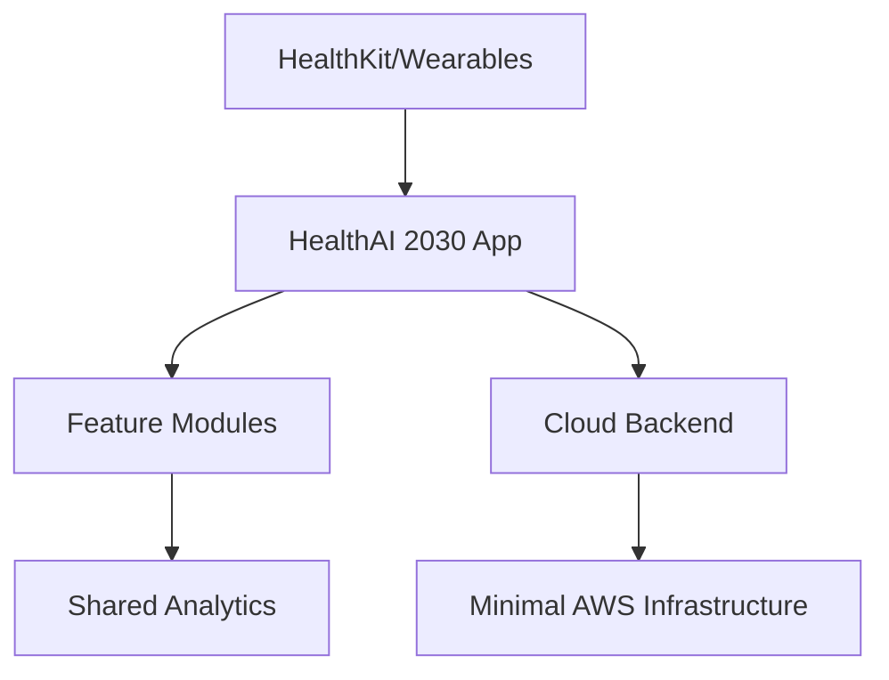

# HealthAI 2030 Architectural Analysis Report

## 1. Current Architecture Overview


## 2. Architectural Strengths
- Modular feature architecture (LogWaterIntake example)
- Clear documentation for planned Digital Health Twin  
- Proper separation of analytics as shared module
- Multi-platform support (iOS, watchOS, tvOS)

## 3. Key Weaknesses/Risks
1. **Implementation Gaps**:
   - Digital Health Twin components missing
   - CardiacHealth module documented but not implemented  
   - Privacy/Security implementations not found

2. **Infrastructure Limitations**:
   - No CI/CD pipeline
   - Minimal monitoring/logging
   - No database/cache services

3. **Cross-cutting Concerns**:
   - Security implementation incomplete
   - Performance optimization missing  
   - Limited test coverage

## 4. High-Priority Recommendations

### Immediate (1-2 weeks):
- Implement missing PrivacySettings component
- Add basic monitoring to K8s (Prometheus/Grafana)
- Complete CardiacHealth module

### Short-Term (1 month):  
- Implement CI/CD pipeline (GitHub Actions)
- Add database services (RDS/PostgreSQL)
- Enhance test coverage (integration tests)  

### Long-Term:
- Implement Digital Health Twin components
- Add advanced performance optimization  
- Implement comprehensive security audit

## 5. Ideal Architecture
```mermaid  
graph TD
    A[Health Data Sources] --> B[HealthAI 2030 App]
    B --> C[Feature Modules]
    C --> D[Shared Services]
    D --> E[Security, Analytics, Performance]
    B --> F[Cloud Backend]
    F --> G[Digital Health Twin]
    F --> H[Monitoring/Logging]
    F --> I[CI/CD Pipeline]